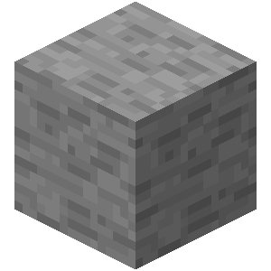
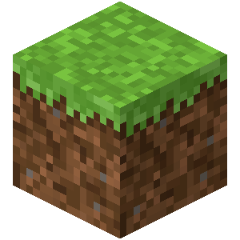
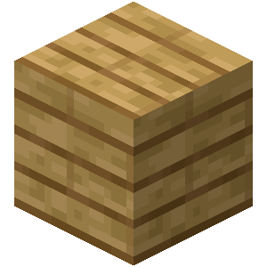
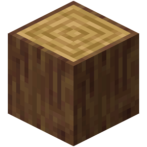

# LibreProg
A fully free and open-source set of assets for Minecraft Beta 1.7.3

## Purpose
The purpose of **LibreProg** is to provide a full set of free and open source assets for anyone to use in their old-school Minecraft projects. In the case of **LibreProg**, it targets Beta 1.7.3.

## How free are the assets?
The textures were created while loosely referencing the original textures, mainly for layout purposes. All colors were eyeballed or done from memory.

## How are assets made?
The app [McPerlin](https://mcperlin.streamlit.app/) was used for a few textures. A few were then tweaked slightly with Aseprite, though [LibreSprite](https://github.com/LibreSprite/LibreSprite) can also be used.

## How can I contribute?
In any way you want! Though for ease to access we recommend sticking to the tools that're already in use.

- [LibreSprite](https://github.com/LibreSprite/LibreSprite)/[Aseprite](https://www.aseprite.org/) for Pixel-art edits
- [Krita](https://krita.org/) for more general artwork (or for those that just prefer it)
- [McPerlin](https://mcperlin.streamlit.app/) or any other program/website that can generate noise. This is just a convenient one I stumbled upon at random

## Examples

| Stone | Grass | Planks | Oak Log |
| :-----: | :----: | :----: | :----: |
|  |  |  |  |

## Progress
- achievement
    - [ ] bg
- armor
    - [ ] chain
    - [ ] cloth
    - [ ] diamond
    - [ ] gold
    - [ ] iron
    - [ ] power
- [ ] art, kz
- environment
    - [ ] clouds
    - [ ] rain
    - [ ] snow
- [ ] font, default
- gui
    - [x] background
    - [ ] container
    - [ ] crafting
    - [ ] furnace
    - [ ] gui
    - [ ] icons
    - [ ] inventory
    - [ ] items.png (WIP)
    - [ ] logo
    - [ ] particles
    - [ ] slot
    - [ ] trap
    - [ ] unknown_pack
- item
    - [ ] arrows
    - [ ] boat
    - [ ] cart
    - [ ] door
    - [ ] sign
- misc
    - [ ] dial
    - [ ] foliagecolor
    - [ ] footprint
    - [ ] grasscolor
    - [ ] mapbg
    - [ ] mapicons
    - [ ] pumpkinblur
    - [x] shadow
    - [x] vignette
    - [ ] water
    - [ ] watercolor
- mob
    - [ ] char
    - [ ] chicken
    - [ ] cow
    - [ ] creeper
    - [ ] ghast
    - [ ] ghast_fire
    - [ ] pig
    - [ ] pigman
    - [ ] pigzombie
    - [ ] saddle
    - [ ] sheep
    - [ ] sheep_fur
    - [ ] silverfish
    - [ ] skeleton
    - [ ] slime
    - [ ] spider
    - [ ] spider_eyes
    - [ ] squid
    - [ ] wolf
    - [ ] wolf_angry
    - [ ] wolf_tame
    - [ ] zombie
- terrain
    - [ ] moon
    - [ ] sun
- title
    - [ ] black
    - [ ] mclogo
    - [ ] mojang
- [ ] pack
- [ ] particles
- [ ] terrain.png (WIP)
- [ ] Sounds
- [ ] Music
